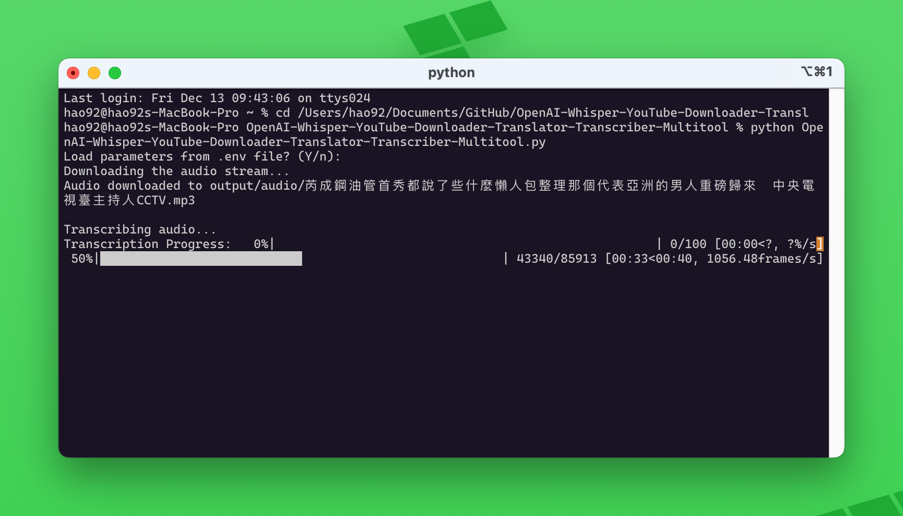
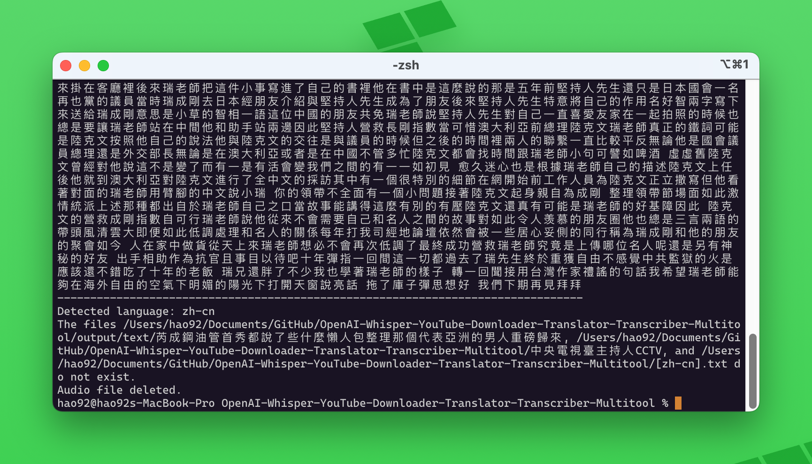

多功能的 YouTube 视频下载和转录工具，使用 OpenAI 的 Whisper 模型进行音频转录。


## Thanks


## 功能特点

- 下载 YouTube 视频和音频
- 使用 OpenAI Whisper 进行音频转录
- 支持多语言转录
- 自动语言检测
- 支持环境变量配置
- 支持进度显示
- 自动添加标点符号（通过 initial_prompt）

## 安装

1. 克隆仓库：

```bash
git clone https://github.com/yourusername/WhispeerYou.git
```

2. 安装依赖：

```bash
pip install -r requirements.txt
```

## 使用方法

1. 创建 `.env` 文件（可选）：
```makefile
YOUTUBE_URL=你的YouTube视频URL
TARGET_LANGUAGE=zh
INITIAL_PROMPT="以下是普通话的句子，这是一段会议记录。"
DOWNLOAD_VIDEO=y
INCLUDE_AUDIO=y
TRANSCRIBE_AUDIO=y
MODEL_CHOICE=base
USE_EN_MODEL=n
DELETE_AUDIO=y
```

2. 运行脚本：

```bash
python WhispeerYou.py
```


3. 按照提示操作：
   - 选择是否使用 .env 文件的配置
   - 输入 YouTube 视频 URL（如果未在 .env 中设置）



## 输出文件

所有输出文件都保存在 `output` 目录下：
- `output/video`: 视频文件
- `output/audio`: 音频文件
- `output/text`: 转录文本文件

## 注意事项

- 确保有足够的磁盘空间
- 首次运行时会下载 Whisper 模型
- 转录大文件可能需要较长时间
- 建议使用 initial_prompt 来提高中文转录的质量
